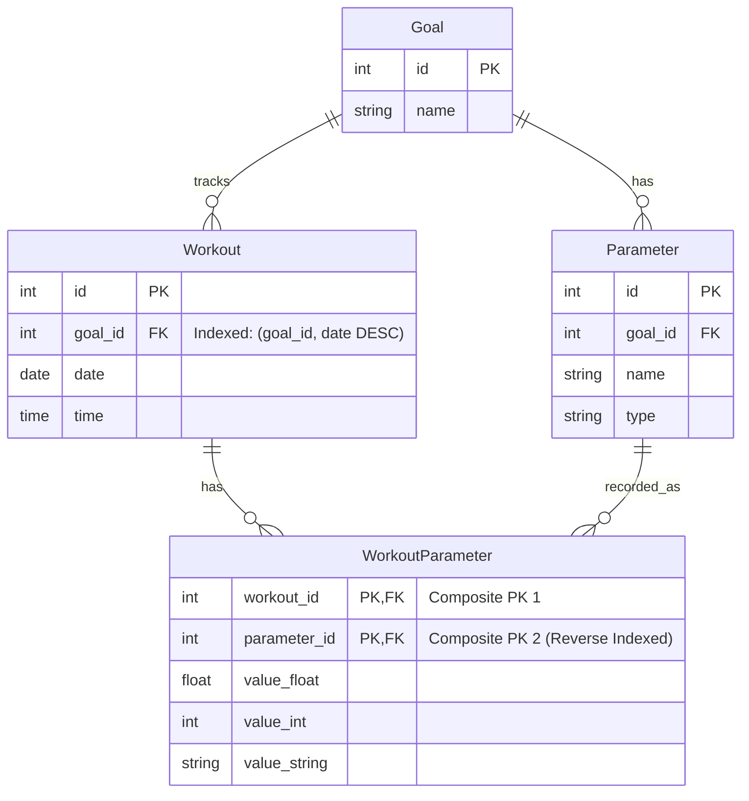

Here is a summary of the finalized database design decisions we have discussed, followed by a Mermaid ER diagram illustrating the updated schema.

---

### Summary of Database Design Decisions

1. **Polymorphic Storage (Sparse Columns)**
    * To support different data types (decimals, integers, strings) without losing database type integrity, `WorkoutParameter` uses three nullable, type-specific columns: `value_float`, `value_int`, and `value_string`.
    * This design keeps data natively typed, which makes database-level calculations (like summing total distance or averaging weight) straightforward and highly performant.

2. **Domain-Specific Naming**
    * The generic term "Attributes" has been updated to **"Parameter"**, and the junction table is now **"WorkoutParameter"**. This aligns more naturally with standard application terminology while separating generic database concepts from your business logic.

3. **Relationship Simplification (1-to-Many)**
    * The separate `Relation` bridge table has been removed. Since a workout belongs to a single goal, `goal_id` is now placed directly in the `Workout` table as a foreign key. This simplifies queries, reduces unnecessary table joins, and improves overall read performance.

4. **Targeted Indexing Strategy**
    * **`Workout` Table:** Indexed on `(goal_id, date DESC)` to optimize dashboards displaying a goal's historical workouts sorted chronologically.
    * **`Parameter` Table:** Indexed on `goal_id` to quickly load all metrics a specific goal tracks.
    * **`WorkoutParameter` Table:**
        * Primary Key on `(workout_id, parameter_id)` to handle fetching all details for a single workout.
        * Secondary index on `(parameter_id, workout_id)` to optimize analytical queries over time (like plotting a chart of a specific parameter's history).

---

### Final Database Schema (Mermaid Diagram)

